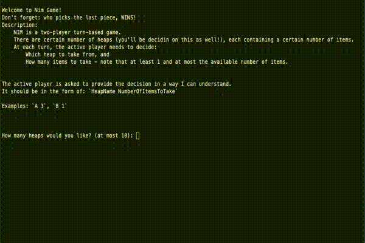

# Nim Game
This repository contains `python` code for kata from [codingdojo.org/kata/Nim/](http://codingdojo.org/kata/Nim/)

For basic informations about Nim game, please refer to : https://en.wikipedia.org/wiki/Nim. As available in the code itself, we explain the game as follows:

```
Welcome to Nim Game!
Don't forget: who picks the last piece, WINS!
Description:
    NIM is a two-player turn-based game.
    There are certain number of heaps (you'll be decidin on this as well!), each containing a certain number of items.
    At each turn, the active player needs to decide:
        Which heap to take from, and
        How many items to take - note that at least 1 and at most the available number of items.
    

The active player is asked to provide the decision in a way I can understand.
It should be in the form of: `HeapName NumberOfItemsToTake`

Examples: `A 3`, `B 1`
```


